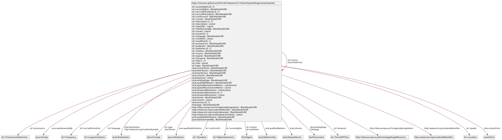
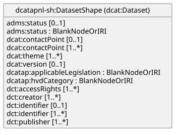
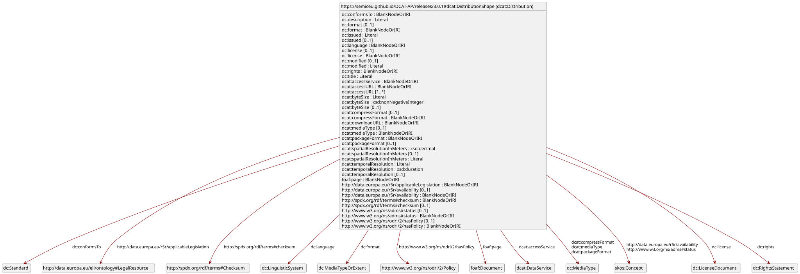
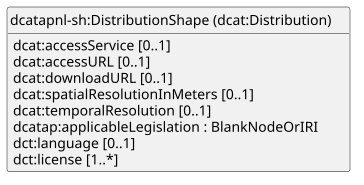

# Dataset Requirements Documentation 

Dataset documentation:
* https://semiceu.github.io/DCAT-AP/releases/3.0.1/#Dataset
* https://docs.geostandaarden.nl/dcat/dcat-ap-nl30/#dataset-dcat-dataset

 

image: DCAT-AP dcat:Dataset SHACL shapes, based on above query ,rendered by [https://shacl-play.sparna.fr/play/](https://shacl-play.sparna.fr/play/). 

 

image: DCAT-AP-NL dcat:Dataset SHACL shapes, based on above query ,rendered by [https://shacl-play.sparna.fr/play/](https://shacl-play.sparna.fr/play/). 


### Dataset Mandatory Properties

See [csvs/ap-nl-dataset-mand-props.csv](csvs/ap-nl-dataset-mand-props.csv) & [csvs/ap-nl-dataset-recommended-props.csv](csvs/ap-nl-dataset-recommended-props.csv) where this info is compiled

**DCAT-AP mandatory properties of dcat:Dataset:**

*  http://purl.org/dc/terms/description
*  http://purl.org/dc/terms/title 

**DCAT-AP-NL mandatory properties of dcat:Dataset:**

* http://purl.org/dc/terms/accessRights - see section "Supportive Entity: RightsStatement"
* http://www.w3.org/ns/dcat#contactPoint 
* http://purl.org/dc/terms/creator 
* http://purl.org/dc/terms/identifier 
* http://purl.org/dc/terms/publisher 
* http://www.w3.org/ns/dcat#theme

* http://www.w3.org/ns/dcat#distribution 
   * dcat:distribution is conditional (for datasets that hold files) but it is very important property

### Dataset Recommended Properties

Recommended Dataset properties from [DCAT-AP-NL Dataset](https://docs.geostandaarden.nl/dcat/dcat-ap-nl30/#dataset-dcat-dataset) are marked with A in the documentation table and formalized in [dcat-ap-nl/shapes/dcat-ap-nl-SHACL-aanbevolen.ttl](dcat-ap-nl/shapes/dcat-ap-nl-SHACL-aanbevolen.ttl). DCAT-AP Dataset recommended properties are formalized in [dcat-ap/releases/3.0.1/html/shacl/shapes_recommended.ttl](dcat-ap/releases/3.0.1/html/shacl/shapes_recommended.ttl).

[csvs/ap-nl-dataset-recommended-props.csv](csvs/ap-nl-dataset-recommended-props.csv) summarizes them.

Below is the same list, with the ones to implement, in bold. And crossed the ones that are not relevant for our context   

* **http://www.w3.org/ns/dcat#keyword**  0..1   literal 	A keyword or tag describing the Dataset. 
    * ODISSEI Portal: use  Keyword ELSST URI (Enriched Metadata block)
    * SSH DS: Use "Keyword Getty AAT" & "Keyword ELSST" URIs - Note: in the future all this might be migrated to the generic keyword field which will require changing the source location of the keyword  
* **http://www.w3.org/ns/dcat#landingPage**    URL
* <s>http://purl.org/dc/terms/conformsTo</s> 0..1 Literal An established standard to which the described resource conforms.
* <s>http://purl.org/dc/terms/spatial</s> NA
* <s>http://purl.org/dc/terms/temporal</s> NA


### Dataset Optional Properties

Optional Dataset properties DCAT-AP-NL & DCAT-AP COULD be implemented, if they are "low-hanging-fruit" and provide important information for the DCAT metadata export.

From [DCAT-AP-NL Dataset](https://docs.geostandaarden.nl/dcat/dcat-ap-nl30/#dataset-dcat-dataset) are marked with "O" in the documentation table and formalized in [dcat-ap-nl/shapes/dcat-ap-nl-OPT.ttl](dcat-ap-nl/shapes/dcat-ap-nl-OPT.ttl). DCAT-AP Dataset recommended properties are formalized in [dcat-ap-nl/shapes/dcat-ap-OPT.ttl](dcat-ap-nl/shapes/dcat-ap-OPT.ttl) .


### Dataset Object Properties
Some of the properties (object properties) require its value to be another instance of a class node, which can be implemented with its unique URI or a blank node.

**Dataset *mandatory* object properties are:**

* property dct:accessRights (1..1) target class dct:RightsStatement
* property dcat:contactPoint (1..1) target class vcard:Kind
* property dct:creator (1..n) target class foaf:Agent
* property dct:publisher (1..1)target class foaf:Agent
* property dcat:theme (1..n) target class skos:Concept from http://publications.europa.eu/resource/authority/data-theme
* property dcat:distribution (0..n) target class dcat:Distribution (conditional, if there are files in dataset)
<!-- 
**Dataset *recommended* object properties are:**

**Dataset *optional* object properties are:** -->

### property dct:accessRights  target class dct:RightsStatement

**Use** `dct:accessRights <http://publications.europa.eu/resource/authority/access-right/PUBLIC>`

**In [DCAT-AP-NL dct:accessRights](https://docs.geostandaarden.nl/dcat/dcat-ap-nl30/#dataset-access-rights) is a mandatory Dataset object property.**
The recommendation from DCAT-AP-NL is to give to provide a value from [Access Rights Named `Authority List](http://publications.europa.eu/resource/authority/access-right). 
Use one of the following values: public (http://publications.europa.eu/resource/authority/access-right/PUBLIC); restricted; non-public.

As all of DANS datasets are public, **restriction only happens at the Distribution level** and not at the Dataset level. Hence, the simple and correct choice is to make the statement: this dataset has `dct:accessRights <http://publications.europa.eu/resource/authority/access-right/PUBLIC>`, for all of the datasets.

### supplement dct:accessRights with dct:license

<div style="border: 4px solid orange; padding: 10px; border-radius: 5px;">
Although DCAT-AP, does not make this recommendation **We should supplement the accessRights statement, by adding to Dataset:**

* `dct:license <https://doi.org/10.17026/fp39-0x58>; #DANS License` OR `dct:license <http://creativecommons.org/publicdomain/zero/1.0>`, etc (see Dataverse license metadata below)

```json
# dataverse JSON metadata 

        "license": {
            "name": "DANS Licence",
            "uri": "https://doi.org/10.17026/fp39-0x58",
            "iconUri": ""
        },
```

```json
xyz a dcat:Dataset ;
    dct:accessRights <http://publications.europa.eu/resource/authority/access-right/PUBLIC> ;
    dct:license <http://creativecommons.org/publicdomain/zero/1.0> ;
    dct:distribution :dist01 .
```

**See section [property dcat:distribution section target class dcat:Distribution](#property-dcatdistribution-target-class-dcatdistribution) for more info on Distribution access-rights & license**
</div>

### property dcat:contactPoint target class vcard:Kind

> This property contains the contact information where end users can contact questions about the dataset. This element contains the **e-mail address or link (URL)** to the contact form of the responsible organization of the dataset. The e-mail address is a functional e-mail address of the organization or organization part.

In essence this property's value is a node with the email address and a bit more information then Organization (see [example in DCAT-AP-NL](https://docs.geostandaarden.nl/dcat/dcat-ap-nl30/#voorbeelden))


**contactPoint for the ODISSEI (Portal)**

```json
   dcat:contactPoint [
     a vcard:Organization ;
     vcard:fn "Open Data Infrastructure for Social Science and Economic Innovations"; # formated name
     vcard:hasEmail <mailto:"portal@odissei.nl"> ;
     vcard:hasURL "https://odissei-data.nl/" ;
     vcard:organization-name "ODISSEI" ;
     dct:identifier <https://ror.org/03m8v6t10> .
     ] ; 
```

**contactPoint for DANS  Data Stations**

```json
dcat:contactPoint [
    a vcard:Organization ;
    vcard:fn "Data Archiving Networked Services (DANS)";
    vcard:hasEmail <mailto:"info@dans.knaw.nl"> ;
    vcard:hasURL "https://dans.knaw.nl/" ;
    vcard:organization-name "DANS" ;
    dct:identifier <https://ror.org/008pnp284> .
    ] ; 
```
Note: that dct:identifier was a personal addition.

### property dct:creator  target class foaf:Agent

* dct:Creator An entity responsible for producing the dataset. 
* foaf:Agent - Any entity carrying out actions with respect to the entities Catalogue and the Catalogued Resources. 
* foaf:name - mandatory property for `foaf:Agent` instances

There might be more than one instance of `dct:creator`


Example in DCAT-AP

```json
   dct:creator [
     dct:type <http://purl.org/adms/publishertype/LocalAuthority> ;
     a foaf:Agent ;
     foaf:name "Mijn Organisatie"@nl;
     foaf:name "My Organization"@en
     ] ;
```

Example created based on https://ssh.datastations.nl/api/datasets/export?exporter=dataverse_json&persistentId=doi%3A10.17026/SS/9BEH4Y author block:
```json
                    {
                        "typeName": "author",
                        "multiple": true,
                        "typeClass": "compound",
                        "value": [
                            {
                                "authorName": {
                                    "typeName": "authorName",
                                    "multiple": false,
                                    "typeClass": "primitive",
                                    "value": "G. van den Berg"
                                },
                                "authorAffiliation": {
                                    "typeName": "authorAffiliation",
                                    "multiple": false,
                                    "typeClass": "primitive",
                                    "value": "Leiden University"
                                },
                                "authorIdentifier": {
                                    "typeName": "authorIdentifier",
                                    "multiple": false,
                                    "typeClass": "primitive",
                                    "value": "0000-0003-0584-8038"
                                }
                            }
                        ]
                    },
```


```json
   dct:creator [
     a foaf:Agent ;
     foaf:name "G. van den Berg";
     # dct:type <http://purl.org/adms/publishertype/PrivateIndividual(s)>
     dct:identifier <https://orcid.org/0000-0003-0584-8038> .
     ] ;
```

We might need to skip the `dct:type` property (which defines the nature of the agent), as  due to its value range being the [ADMS publisher type vocabulary](https://raw.githubusercontent.com/SEMICeu/ADMS-AP/master/purl.org/ADMS_SKOS_v1.00.rdf). This constraint require infering to know what is type of creator, in order to select and approviate value from [ADMS publisher type vocabulary](https://raw.githubusercontent.com/SEMICeu/ADMS-AP/master/purl.org/ADMS_SKOS_v1.00.rdf) (see values below). 

This might be easier for SSH DS, where creators are often individual (`http://purl.org/adms/publishertype/PrivateIndividual(s)`), but in the ODP we have organizations as creators, which can either be Academia/Scientific organisation, Non-Governmental Organisation, etc.


    Academia/Scientific organisation http://purl.org/adms/publishertype/Academia-ScientificOrganisation
    Company http://purl.org/adms/publishertype/Company
    Industry consortium http://purl.org/adms/publishertype/IndustryConsortium
    Local Authority http://purl.org/adms/publishertype/LocalAuthority
    National authority http://purl.org/adms/publishertype/NationalAuthority
    Non-Governmental Organisation http://purl.org/adms/publishertype/NonGovernmentalOrganisation
    Non-Profit Organisation http://purl.org/adms/publishertype/NonProfitOrganisation
    Private Individual(s) http://purl.org/adms/publishertype/PrivateIndividual(s)
    Regional authority http://purl.org/adms/publishertype/RegionalAuthority
    Standardisation body http://purl.org/adms/publishertype/StandardisationBody
    Supra-national authority http://purl.org/adms/publishertype/SupraNationalAuthority

### property dct:publisher target class foaf:Agent

* An entity (organisation) responsible for making the Dataset available.
* If the Agent is an organisation, the use of the Organization Ontology is recommended. 
* there can only be 1 publisher


For SSH DS

```json
   dct:publisher [
     a foaf:Agent ;
     foaf:name "DANS Data Station Social Sciences and Humanities";
     ] ;
```

For the ODISSEI Portal. It will be a bit tricky, since there are multiple publishers, however that information is not correct in the ODP (see [ticket ODSP-369](https://drivenbydata.atlassian.net/browse/ODSP-369))

In the mean time, until the bug is fixed, we might need to go with the incorrect statement `publisher = ODISSEI Portal`, captured from the Portal metadata.


```json
   dct:publisher [
     a foaf:Agent ;
     foaf:name "ODISSEI Portal";
     ] ;
```

<div style="border: 4px solid orange; padding: 10px; border-radius: 5px;">

### property dcat:distribution target class dcat:Distribution 

* Definition: A physical embodiment of the Dataset in a particular format. 
* conditional property: if there are files in dataset. Does not apply to the ODP


**Mandatory dcat:Distribution properties:**

* dcat:accessURL (DCAT-AP)  ie. https://ssh.datastations.nl/file.xhtml?fileId=618769 
* dct:license (DCAT-AP-NL) - CANNOT be implement since Dataverse does not allow for license at file-level (Linda and Alessandra have been workinng on this)

**Additional DANS properties**:

* dct:accessRights - allowed values:
  * `<http://publications.europa.eu/resource/authority/access-right/PUBLIC>` WHEN `files[].restricted": false`
  * `<http://publications.europa.eu/resource/authority/access-right/RESTRICTED>` WHEN `files[].restricted": true`

**Interesting (optional) dcat:Distribution properties:**

* dtc:description (data prop) Source: `files[].description`
* dct:issued (data prop) The date of formal issuance. Source: `files[].publicationDate`
* dtc:title  (data prop). Source:`files[].label`
* dcat:downloadURL.  Source: https://ssh.datastations.nl/api/access/datafile/ + `files[].dataFile.id`
* dct:format file format of the Distribution. Source: `files[].dataFile.contentType` OR `files[].dataFile.friendlyType` 
  * Note: DCAT-AP-NL recommends using values from https://publications.europa.eu/resource/authority/file-type however this list is hard to match with Dataverse file format key:values (ie."contentType": "application/pdf", "friendlyType": "Adobe PDF",). Hence sticking with dataverse values is best
<!-- * dcat:packageFormat "The format of the file in which one or more data files are grouped together" Range: [IANA media type](https://www.iana.org/assignments/media-types/media-types.xhtml) **Value: `<https://www.iana.org/assignments/media-types/application/zip>`** -->

* http://spdx.org/rdf/terms#checksum (object property) 
  * Class: a <http://spdx.org/rdf/terms#Checksum>
  * http://spdx.org/rdf/terms#algorithm = SHA1  (used by Dataverse)
  * http://spdx.org/rdf/terms#checksumValue


**Future Distribution properties:**

* dct:license (DCAT-AP-NL) - *Once Dataverse allows for license at file level**
* odrl:hasPolicy has policy -	Policy 	0..1 	The policy expressing the rights associated with the distribution if using the [ODRL] vocabulary. **Once ODRL work is in place**
* dct:conformsTo (linked schemas). **Once structured data has accompaining schema**


```json
xyz a dcat:Dataset ;
    dct:accessRights <http://publications.europa.eu/resource/authority/access-right/PUBLIC> ;
    dct:license <http://creativecommons.org/publicdomain/zero/1.0> ;
    dct:distribution :dist01 .

dis01 a dcat:Distribution ;
    dct:accessRights <http://publications.europa.eu/resource/authority/access-right/PUBLIC> ;
    dct:issued "2025-09-11"^^xsd:date ;
    dcat:downloadURL <https://ssh.datastations.nl/api/access/datafile/617085>
    spdx:checksum [
      a spdx:Checksum ;
      spdx:algorithm "SHA1" ; #  (used by Dataverse)
      spdx:checksumValue  "f604fa61ba714a8860dc6d416a6db5dea7d9dfea" .
    ]
```

SSH DS file (distribution) metadata:

```json
        "files": [
            {
                "description": "Codebook Hbo Monitor data 2024",
                "label": "HBO 2024 documentatie.pdf",
                "restricted": false,
                "version": 1,
                "datasetVersionId": 28330,
                "dataFile": {
                    "id": 617085,
                    "persistentId": "",
                    "filename": "HBO 2024 documentatie.pdf",
                    "contentType": "application/pdf",
                    "friendlyType": "Adobe PDF",
                    "filesize": 2036650,
                    "description": "Codebook Hbo Monitor data 2024",
                    "storageIdentifier": "surf://store:199336ad9b0-31bc5a7f1ba7",
                    "rootDataFileId": -1,
                    "checksum": {
                        "type": "SHA-1",
                        "value": "f604fa61ba714a8860dc6d416a6db5dea7d9dfea"
                    },
                    "tabularData": false,
                    "creationDate": "2025-09-10",
                    "publicationDate": "2025-09-11",
                    "fileAccessRequest": true
                }
            },
```


```json
"files": [
    {
        "description": "Tape 1\nPlace :1) Xorugh ; 2) Sokhsharw\nDate : 1) 18-7-1998 ; 2) 21-7-1998\nPerformer(s):  \t\n1) Cheragal Avazbekova; 2) Cheragal Avazbekova, Akdodov Niyoz Surobovich\nTotal recording time: 54.10\nContents: dargîlik/folksinging\n",
        "label": "01 Shughnan Sokhsharv 1998.wav",
        "restricted": true,
        "version": 3,
        "datasetVersionId": 28743,
        "dataFile": {
            "id": 618769,
            "persistentId": "",
            "filename": "01 Shughnan Sokhsharv 1998.wav",
            "contentType": "audio/wav",
            "friendlyType": "Waveform Audio",
            "filesize": 624885968,
            "description": "Tape 1\nPlace :1) Xorugh ; 2) Sokhsharw\nDate : 1) 18-7-1998 ; 2) 21-7-1998\nPerformer(s):  \t\n1) Cheragal Avazbekova; 2) Cheragal Avazbekova, Akdodov Niyoz Surobovich\nTotal recording time: 54.10\nContents: dargîlik/folksinging\n",
            "storageIdentifier": "surf://store:19c7aa8b525-5c20093f5098",
            "rootDataFileId": -1,
                "checksum": {
                    "type": "SHA-1",
                    "value": "6bd63de496520e16f5cc692729fccc25434fb9ae"
                },
            "tabularData": false,
            "creationDate": "2026-02-20",
            "publicationDate": "2026-02-23",
            "fileAccessRequest": true
        }
    }]
```


 
image: dcat:Distribution SHACL shapes in DCAT-AP


 

image: dcat:Distribution SHACL shapes in DCAT-AP-NL. 


Example:

```

exampleMS:1T2p3o4B a dcat:Dataset;
   dct:title "Naam van de dataset"@nl;
   dcat:distribution exampleMS:1T2p3o4B-dist-SHP;
   dcat:distribution exampleMS:1T2p3o4B-dist-WMS .

exampleMS:1T2p3o4B-dist-SHP a dcat:Distribution;
   dcat:accessURL <https://orgea.exampleMS.gov/files/1T2p3o4B.shp> ;
   dcatap:applicableLegislation <http://data.europa.eu/eli/reg_impl/2023/138/oj>;
   dcat:downloadURL <https://orgea.exampleMS.gov/files/1T2p3o4B.shp> ;
   dct:language <http://publications.europa.eu/resource/authority/language/NLD> ;
   dct:license <http://creativecommons.org/publicdomain/zero/1.0/deed.nl> ;
   dct:conformsTo <http://inspire.ec.europa.eu/schemas/hy/4.0/HydroBase.xsd> ;
   dcat:mediaType <https://www.iana.org/assignments/media-types/application/vnd.shp>
   .
```
</div>


### Dataset *Data Theme* Controlled Values

From the mandatory Dataset properties, only **dcat:theme has a skos:Concept as range.**
The advised vocabulary to use is the "Data theme" http://publications.europa.eu/resource/authority/data-theme (view [human-readable interface](https://op.europa.eu/web/eu-vocabularies/concept-scheme/-/resource?uri=http://publications.europa.eu/resource/authority/data-theme)). Where the candidate concept for SSH/ODISSEI seems to be :
* [SOCI](http://publications.europa.eu/resource/authority/data-theme/SOCI) Population and society

Other possible themes are [ECON](https://op.europa.eu/en/web/eu-vocabularies/concept/-/resource?uri=http://publications.europa.eu/resource/authority/data-theme/ECON) Economy and finance & [EDUC](https://op.europa.eu/web/eu-vocabularies/concept/-/resource?uri=http://publications.europa.eu/resource/authority/data-theme/EDUC) Education, culture and sport, but these seem to be too specific and not matching the SSH DS and ODISSEI Portal domains. https://op.europa.eu/en/web/eu-vocabularies/concept-scheme/-/resource?uri=http://publications.europa.eu/resource/authority/data-theme contains more detailed info 

Other URIs from other controlled vocabularies can be used. Options for this are
* SSH DS/ODISSEI - Audience field: [NARCIS  Classification of Scientific Disciplines](https://vocabs.datastations.nl/NARCIS/en/) 
* SSH DS -  CESSDA Topic Classification field [CESSDA Topic Classification](https://vocabularies.cessda.eu/vocabulary/TopicClassification?v=4.2#MediaCommunicationAndLanguage.LanguageAndLinguistics)
* SSH DS -  Keyword ELSST field [ELSST Thesaurus](https://thesauri.cessda.eu/elsst) although ELSST scope is broader than data themes


        **Important:  In the ODISSEI Portal the controlled terms, except "Audience" *are not written* into to the metadata as URI, but simply as its label strings. It is unfortunate this is such, as we can not link to the name-entity behind those labels.** String can be used as `dcat:dataTheme` but it is not ideal. 
        See sections of metadata from [doi:10.60641/TR3E-M937](https://portal.odissei.nl/dataset.xhtml?persistentId=doi:10.60641/TR3E-M937)

        ```json
            {
                "typeName": "subject",
                "multiple": true,
                "typeClass": "controlledVocabulary",
                "value": [
                    "Social Sciences"
                ]
            },

            {
                "typeName": "topicClassification",
                "multiple": true,
                "typeClass": "compound",
                "value": [
                    {
                        "topicClassValue": {
                            "typeName": "topicClassValue",
                            "multiple": false,
                            "typeClass": "primitive",
                            "value": "mental health"
                        }
                    }
                ]
            }
            
        ```