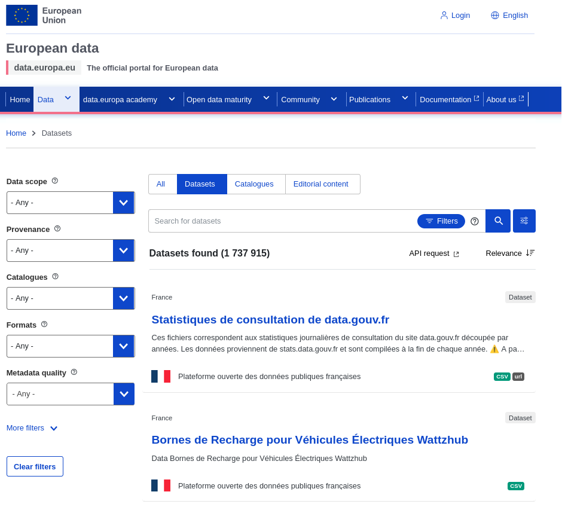
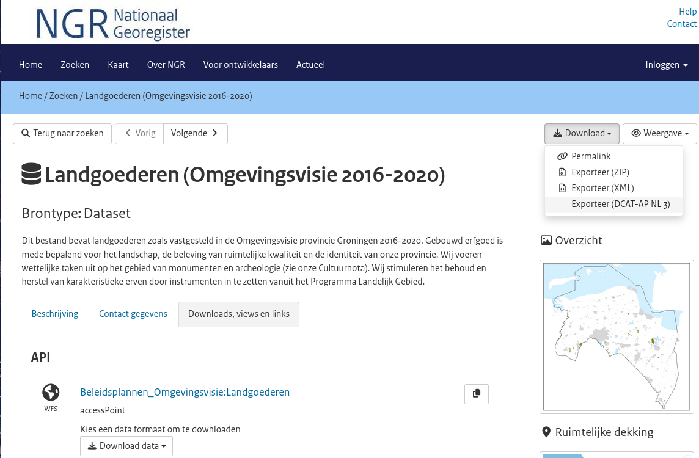

# Deliverable 2026-D06 DCAT-AP-NL metadata exported for Dataverse

> [!WARNING]
> This document is outdate. The current version is in [DCAT-AP-NL-DANS-reqs.docx ](https://knaw.sharepoint.com/:w:/s/msteams_d7e185/IQAARWfhU1fsQ5_VvcQFBA5_AUVf2H0z0tz6fOgXY2ZNiiw?e=oUpsc3) (DANS SharePoint)

This document is a conversions of https://github.com/Dans-labs/dcat-ap-requirements-analysis/blob/main/DCAT-AP-NL-DANS-reqs.md
and replaces [Deliverable-2026-D08-DCAT-AP](https://knaw.sharepoint.com/:w:/r/sites/msteams_d7e185/Gedeelde%20documenten/General/Deliverables/2025/2025-D08%20DCAT-AP/Deliverable-2026-D08-DCAT-AP.docx?d=we0c9073c621a48f68c9d98f991f9a053&csf=1&web=1&e=khClOO)

# Document Control

| **Title**            | Deliverable 2025-D01 - DCAT-AP-NL metadata exported for Dataverse |
|----------------------|-------------------------------------------------------------------|
| **Document Version** | 0.1                                                               |
| **Date**             | 2025-04-08                                                        |
| **Prepared By**      | Andre Castro                                                      |
| **Project**          | SSHOC-NL                                                          |
| **Status**           | Draft proposal – no deliverable number yet                        |
| **Git Repo**         | <https://github.com/Dans-labs/dcat-ap-requirements-analysis/>     |

# Document Revision History

| **Version** | **Date**   | **Author**        | **Description of Changes** | **Approver** |
|-------------|------------|-------------------|----------------------------|--------------|
| 0.1         | 2025-04-08 | Andre Castro      | 1st draft       | N/A          |
| 0.1.1       | 2025-06-03 | Ricarda Braukmann | Initial feedback on draft  |              |
| 0.2.0       | 2026-02-05 | Andre Castro      | MOSCOW Requirements               |              |

# Context

The [DCAT Application
Profile[^1]](https://semiceu.github.io/DCAT-AP/releases/3.0.0/) for data
portals in Europe (DCAT-AP) is a specification based on W3C's Data
Catalogue vocabulary (DCAT) for describing public sector datasets in
Europe. Its basic use case is to enable a
cross-data portal search for datasets and make public sector data better
searchable across borders and sectors.

DCAT-AP allows data catalogues to describe their dataset collections
using a standardized schema, while keeping their own system for
documenting and storing them. It defines mandatory, recommended or
optional classes and properties for describing entities related to
research data, such as dcat:Dataset, dcat:Distribution,
dcat:DataService.

[DCAT-AP-NL (3.0)](https://geonovum.github.io/DCAT-AP-NL30/)is an
extension of DCAT-AP, which expands DCAT-AP, with further restrictions,
mostly through expansion of mandatory and recommended properties of
DCAT-AP (3.0). For instance, the properties dct:identifier and
dct:accessRights for dcat:Dataset are mandatory in DCAT-AP-NL 3, while
DCAT-AP (3.0) only makes dct:title and dct:description mandatory.[^2]

## Recent Developments: Dataverse exporter for DCAT-AP 3

Developers from the TNO have started to develop a Dataverse exporter for
DCAT-AP 3 <https://github.com/gdcc/exporter-dcat3> and since the
exported has been included in GDCC Github organization.

The code quality and potential for customization are quite good. Some of
the very positive points we see in the extensions are:

- Great code quality

- Automated tests are included

- Customization is easy and powerful: ie. values from fields from custom
  metadata blocks can be capture, via extension templates

- OAI-PMH enabled (output in RDF XML) for allowing harvesting of
  published Datasets metadata via OAI-PMH interface

- Embraced by the Dataverse community by bringing it to the GDCC Github
  organization.

**If we work from this extension, then we can really focus on the
quality of the output, ensuring the output is as rich and DCAT-AP-NL
compliant.**

## Data Portals using DCAT-AP

data.europa.eu (<https://data.europa.eu/>)
- [Example dataset subventions-declic-energie](https://data.europa.eu/data/datasets/https-data-seineouest-fr-explore-dataset-subventions-declic-energie-?locale=en) see [dcat-ap metadata record](https://data.europa.eu/api/hub/repo/datasets/https-data-seineouest-fr-explore-dataset-subventions-declic-energie-.ttl?useNormalizedId=true&locale=en)

Nationaal Georegister (<https://www.nationaalgeoregister.nl>) 
- [Example dataset 9ffddf33-8ae5-423f-b275-6bc2580b83e6](https://www.nationaalgeoregister.nl/geonetwork/srv/dut/catalog.search#/metadata/9ffddf33-8ae5-423f-b275-6bc2580b83e6) (see [dcat-ap metadata record](https://www.nationaalgeoregister.nl/geonetwork/srv/api/records/9ffddf33-8ae5-423f-b275-6bc2580b83e6/formatters/dcat-ap-nl-3?output=xml))

# Goal

The goal of this deliverable is to **customize and deploy** the [DCAT-AP Dataverse metadata exporter](https://github.com/gdcc/exporter-dcat3), in order to enable **Dataset metadata exports**, **complient with DCAT-AP-NL (3.0)**, in both **ODISSEI Portal** and **Data Station SSH**.

# Requirements

## Data Provider requirements by SEMIC-DCAT-AP 

From [SEMIC
documentation](https://semiceu.github.io/DCAT-AP/releases/3.0.1/#provider-requirements:~:text=4%2E1%2E1%20Provider%20requirements)
*4.1.1 Provider requirements*: (summarized under next section)

> [!IMPORTANT]
> Crossed-out items are out of scope.

<!-- TODO: integrate these items in  SSHOC-NL/DANS -->

*In order to conform to this Application Profile, an application that
provides metadata MUST:*

- REQ-SEMIC-DCAT-AP-01: *Provide a description of the Catalogue, including at least the
  mandatory properties specified for the class
  [Catalogue](https://semiceu.github.io/DCAT-AP/releases/3.0.1/#Catalogue).*

- REQ-SEMIC-DCAT-AP-02: *Provide descriptions of **Datasets** in the Catalogue, including at
  least the mandatory properties for the class
  [Dataset](https://semiceu.github.io/DCAT-AP/releases/3.0.1/#Dataset).*

- REQ-SEMIC-DCAT-AP-03: *Provide descriptions of **Distributions**, if any, of Datasets in the
  Catalogue, including at least the mandatory properties for the class
  [Distribution](https://semiceu.github.io/DCAT-AP/releases/3.0.1/#Distribution).*

- REQ-SEMIC-DCAT-AP-04: *Provide descriptions of Data Services, if any, of Datasets in the
  Catalogue, including at least the mandatory properties for the class
  [Data
  Service](https://semiceu.github.io/DCAT-AP/releases/3.0.1/#DataService).*

- REQ-SEMIC-DCAT-AP-05: *Provide descriptions of all **organisations** involved in the
  descriptions of Catalogue and Datasets, including at least the
  mandatory properties for the class
  [Agent](https://semiceu.github.io/DCAT-AP/releases/3.0.1/#Agent).*

- REQ-SEMIC-DCAT-AP-06: *Apply the publication requirements for the controlled vocabularies as
  mentioned in section [10. Controlled
  Vocabularies](https://semiceu.github.io/DCAT-AP/releases/3.0.1/#controlled-vocs).*

*For the properties listed in the table in section [10. Controlled
Vocabularies](https://semiceu.github.io/DCAT-AP/releases/3.0.1/#controlled-vocs),
the associated controlled vocabularies MUST be used. Additional
controlled vocabularies MAY be used. In addition to the mandatory
properties, any of the recommended and optional properties defined in
section [A. Quick Reference of Classes and
Properties](https://semiceu.github.io/DCAT-AP/releases/3.0.1/#quick-reference)
MAY be provided.*

## SSHOC-NL/DANS Requirements for DCAT-AP-NL metadata exporter for Dataverse

> [!IMPORTANT]
> Use [DCAT-AP-NL-DANS-implementation-guide.md](DCAT-AP-NL-DANS-implementation-guide.md) for complementary information to the requirements.

- REQ-SSHOC-DCAT-AP-01: MUST export metadata, in conformance with DCAT-AP-NL, from datasets indexed in ODISSEI Portal (ODP).[^3]

- REQ-SSHOC-DCAT-AP-02: MUST export metadata, in conformance with DCAT-AP-NL, from Datasets hosted in Data Station SSH.

- REQ-SSHOC-DCAT-AP-03: MUST export metadata in turtle (.ttl) RDF encoding

- REQ-SSHOC-DCAT-AP-04: MUST focus the export in the dcat:Dataset instance and supportive entities

- REQ-SSHOC-DCAT-AP-05: MUST include the following dcat:Dataset mandatory properties [DCAT-AP-NL] and for its object properties, the corresponding *target* class instances or URIs:
  - dct:title (1..1)
  - dct:identifier (1..1)
  - dct:description (1..1)
  - dct:accessRights (1..1) URI value: http://publications.europa.eu/resource/authority/access-right/PUBLIC (see [^4] Note on DANS accessRights; see [DCAT-AP-NL-DANS-implementation-guide.md#property-dctaccessrights--target-class-dctrightsstatement](DCAT-AP-NL-DANS-implementation-guide.md#property-dctaccessrights--target-class-dctrightsstatement)) 
  - dcat:contactPoint (1..1) target class vcard:Kind (see [DCAT-AP-NL-DANS-implementation-guide.md#property-dcatcontactpoint-target-class-vcardkind](DCAT-AP-NL-DANS-implementation-guide.md#property-dcatcontactpoint-target-class-vcardkind))
  - dct:creator (1..n) target class foaf:Agent
  - dcat:distribution (1..n) target class dcat:Distribution (conditional, if there are files in dataset) (see [DCAT-AP-NL-DANS-implementation-guide.md#property-dcatdistribution-target-class-dcatdistribution](DCAT-AP-NL-DANS-implementation-guide.md#property-dcatdistribution-target-class-dcatdistribution))
  - dct:publisher (1..1) target class foaf:Agent (see [DCAT-AP-NL-DANS-implementation-guide.md#property-dctpublisher-target-class-foafagent](DCAT-AP-NL-DANS-implementation-guide.md#property-dctpublisher-target-class-foafagent))
  - dcat:theme (1..n) target class skos:Concept from http://publications.europa.eu/resource/authority/data-theme Suggestion for SSH DS & ODP [SOCI](http://publications.europa.eu/resource/authority/data-theme/SOCI) Population and society (see [DCAT-AP-NL-DANS-implementation-guide.md#dataset-data-theme-controlled-values](DCAT-AP-NL-DANS-implementation-guide.md#dataset-data-theme-controlled-values))

- REQ-SSHOC-DCAT-AP-06: MUST include the following dcat:Dataset recommended properties [DCAT-AP-NL]
  - dct:conformsTo (0..1)  Value: "DCAT-AP-NL30"; Desc: *An established standard to which the described resource conforms*.
  - dcat:landingPage (0..n) URL "The web page that provides access to the dataset and provides additional information about the dataset. This is the original web page of the data owner."

- REQ-SSHOC-DCAT-AP-07: COULD include the following dcat:Dataset recommended properties [DCAT-AP-NL]
  - dcat:keyword  (0..n)  Note that dcat:keyword is data property, hence its values have to be literals, and not URIs (such as the terms in Getty AAT, ELSST, etc).

- REQ-SSHOC-DCAT-AP-08: COULD include "Keyword Getty AAT" and "Keyword ELSST" values' URIs in the dcat:theme property 

- REQ-SSHOC-DCAT-AP-09: MUST include the supportive entity dcat:Distribution (value of dcat:Dataset dcat:distribution) to represent data files, with fellowing properties: (see implementation examples in [DCAT-AP-NL-DANS-implementation-guide.md#property-dcatdistribution-target-class-dcatdistribution](DCAT-AP-NL-DANS-implementation-guide.md#property-dcatdistribution-target-class-dcatdistribution))
  - MUST include dcat:accessURL [DCAT-AP] (1..1) ie. https://ssh.datastations.nl/file.xhtml?fileId=618769 
  - WONT include <s>dct:license [DCAT-AP-NL]</s> - WONT be implemented since Dataverse does not allow for license at file-level
  - MUST include dct:rights (0..1) - allowed values:
    - `<http://publications.europa.eu/resource/authority/access-right/PUBLIC>` WHEN `files[].restricted": false`
    - `<http://publications.europa.eu/resource/authority/access-right/RESTRICTED>` WHEN `files[].restricted": true`
    - SHOULD include dtc:description (0..n)
    - SHOULD include dct:issued (0..1) The date of formal issuance
    - SHOULD include dtc:title  (1..n)
    - SHOULD include dcat:downloadURL (1..n) The URL of he downloadable file in a specific format.   Source: https://ssh.datastations.nl/api/access/datafile/
    - SHOULD include dct:format file format of the Distribution  (see [^5] Note on DCAT-AP-NL file-type recommendations )
    - SHOULD include spdx:checksum (0..1) (object property) [^6] with the following:
      - Class: spdx:Checksum
      - property: spdx:algorithm = SHA1  (used by Dataverse)
      - property: spdx:checksumValue

- REQ-SSHOC-DCAT-AP-10: MUST include one supportive entity vcard:Kind (value of dcat:contactPoint) to describe the contact information where end users can send questions about the dataset. (see implementation examples in [DCAT-AP-NL-DANS-implementation-guide.md#property-dcatcontactpoint-target-class-vcardkind](DCAT-AP-NL-DANS-implementation-guide.md#property-dcatcontactpoint-target-class-vcardkind))
  - MUST include its own URI
  - MUST include class vcard:Organization 
  - MUST include vcard:fn (formatted name)
  - MUST include vcard:hasEmail
  - MUST include vcard:hasURL
  - SHOULD include vcard:organization-name 
  - SHOULD include dct:identifier (organization ROR)

- REQ-SSHOC-DCAT-AP-11: MUST include the supportive entity foaf:Agent (value of dcat:creator, dcat:publisher) to describe the creator and publisher of the dataset.
  - For dcat:creator (see [DCAT-AP-NL-DANS-implementation-guide.md#property-dctcreator--target-class-foafagent](DCAT-AP-NL-DANS-implementation-guide.md#property-dctcreator--target-class-foafagent))
    - MUST include a node, instance of class foaf:Agent, for each creator
    - MUST include foaf:name
    - SHOULD include individual dct:identifier with ORCID URL as value
    - WONT include dct:type property
  - For dcat:publisher (see [DCAT-AP-NL-DANS-implementation-guide.md#property-dctpublisher-target-class-foafagent](DCAT-AP-NL-DANS-implementation-guide.md#property-dctpublisher-target-class-foafagent))
    - MUST include a node, instance of class foaf:Agent
    - MUST include foaf:name
    - SHOULD include organization dct:identifier with ROR URL as value
    - WONT include <s>dct:type</s> property

> [!IMPORTANT]
> In the ODISSEI Portal each dataset should have as publisher the dataset holder (ie. publisher = LISS), however the portal classifies all datasets with `publisher = ODISSEI Portal`, which is an incorrect statement (see bug-repoer [ticket ODSP-369](https://drivenbydata.atlassian.net/browse/ODSP-369)). Until bug is fixed, we might need to go with the incorrect statement `publisher = ODISSEI Portal`, captured from the Portal metadata.

- REQ-SSHOC-DCAT-AP-12: SHOULD use URIs instead of blank nodes for resources that can be reused in multiple descriptions ie. vcard:Kind (value of dcat:contactPoint), foaf:Agent (value of dcat:publisher), dcat:Catalog.

> As the use of blank nodes is discouraged for resources that can be reused in multiple descriptions, a URI needs to be available for the publisher. In some environments, a central URI set is available or in the process of being set up.
Source: https://interoperable-europe.ec.europa.eu/collection/semic-support-centre/solution/dcat-application-profile-implementation-guidelines/release-10

- REQ-SSHOC-DCAT-AP-13: COULD include an instance of dcat:Catalog, in each export, to represent the data-repository/data-portal (DS SSH or ODP), and establish the relation *this catalog (ODP) has dataset* via dcat:Catalog dcat:dataset, towards dcat:Dataset instance. (see [DCAT-AP-NL-DANS-implementation-guide.md#Catalog](DCAT-AP-NL-DANS-implementation-guide.md#Catalog)). Although introducting a dcat:Catalog node will bring some context to where the dataset is hosted/indexed, this node is not included in many DCAT-AP dataset export examples (ie. <https://data.europa.eu/>, <https://www.nationaalgeoregister.nl/>).

- REQ-SSHOC-DCAT-AP-14: COULD include instances of dcat:DataService, in each export, to represent "the operations that provides access to one or more datasets or data processing functions. Source: <https://www.w3.org/TR/vocab-dcat-3/#Class:Data_Service>. Note that DCAT-AP-NL puts quite a lot of mandatory properties, on dcat:DataService, making it difficult to comply accuratly

- REQ-SSHOC-DCAT-AP-15: SHOULD allow OAI-PMH harvesting in XML RDF encoding, in Data Station SSH

- REQ-SSHOC-DCAT-AP-16: COULD allow OAI-PMH harvesting in XML RDF encoding, in ODISSEI Portal. (Conceptually this is discouraged, as the ODP is an data aggregator and not a data publisher. We sould avoid the situation where datasets are harvested twice, from both the data provider and the ODP, which might lead to 2 duplicated dataset records exisiting the harvesting aggregator)

# Links and References

- DANS DCAT-AP research repository
  <https://github.com/Dans-labs/dcat-sandbox>

- DCAT-AP Documentation
  <https://semiceu.github.io/DCAT-AP/releases/3.0.0/>

- DCAT-AP Repository <https://github.com/SEMICeu/DCAT-AP>

- Documentation <https://geonovum.github.io/DCAT-AP-NL30/>

- Dataverse DCAT-AP-NL metadata exporter:
  <https://github.com/Geonovum/DCAT-AP-NL30/>

# Footnotes

[^1]: Application profile: A set of metadata elements, policies, and
    guidelines defined for a particular application.

[^2]: A KG that holds the DCAT-AP-NL representation of both dataset
    collections, might be achievable either by including these
    dcat:Dataset instances in the KG being built by the VU. Yet, that
    might prove more work than serving the FAIRy Datasets in the ODISSEI
    Portal. The latter option might prove more difficult politically.

[^3]: Note: The configuration/development/testing of the DCAT-AP exporter, in the Odissei Portal, should precede the same work in the Data Station SSH, since the docker setup of the ODP provides a simpler development environment than that of the Data Station SSH.

[^4]: Note on DANS accessRights: The recommendation from DCAT-AP-NL is to provide a value from [Access Rights Named `Authority List](http://publications.europa.eu/resource/authority/access-right), such as public, restricted, non-public. As all of DANS datasets (metadata) is publicly accessible, restrictions only happen at the Distribution level and not at the Dataset level. Hence, the simple and correct choice is to make the statement: this dataset has `dct:accessRights <http://publications.europa.eu/resource/authority/access-right/PUBLIC>`, for all of the datasets.

[^5]: Note on DCAT-AP-NL file-type recommendations: DCAT-AP-NL recommends using values from https://publications.europa.eu/resource/authority/file-type however this list is hard to match with Dataverse file format (ie."contentType": "application/pdf", "friendlyType": "Adobe PDF",). Hence sticking with Dataverse contentType or friendlyType values is best.
      <!-- * dcat:packageFormat "The format of the file in which one or more data files are grouped together" Range: [IANA media type](https://www.iana.org/assignments/media-types/media-types.xhtml) **Value: `<https://www.iana.org/assignments/media-types/application/zip>`** -->

[^6]: `@prefix spdx: <http://spdx.org/rdf/terms#>`
